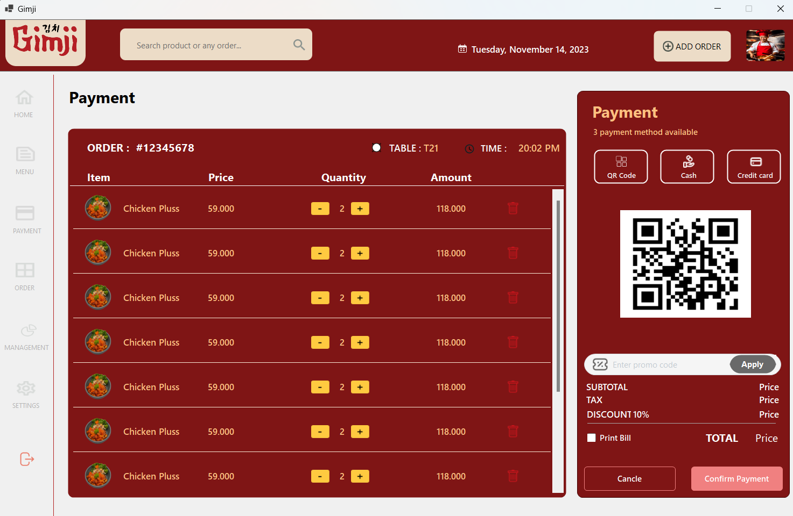
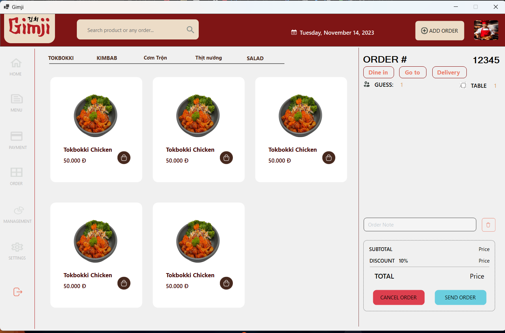
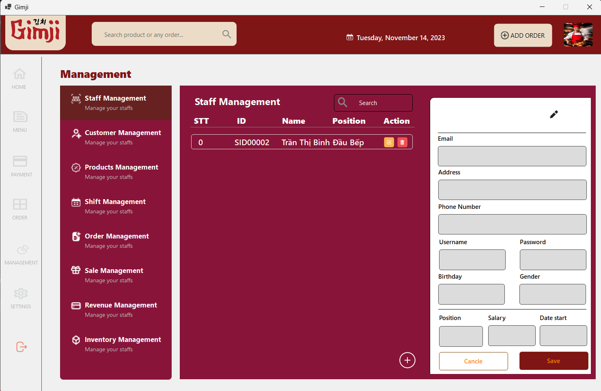
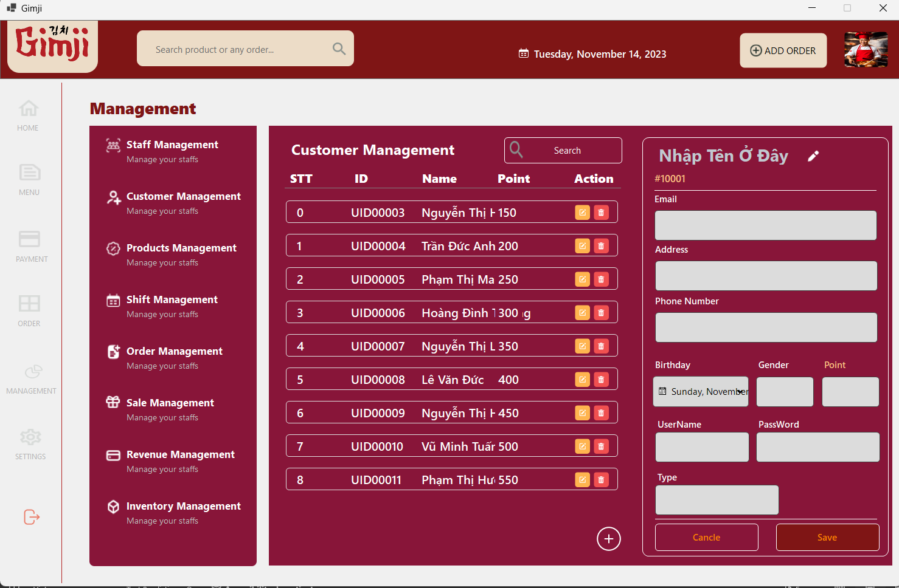
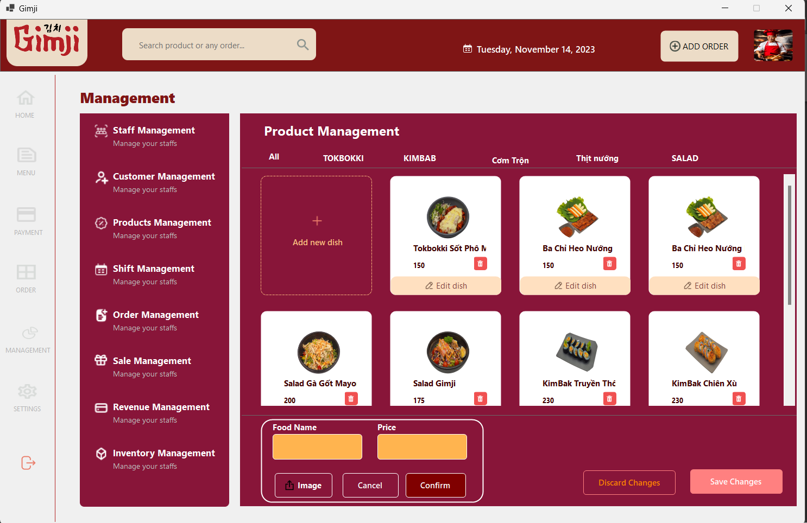
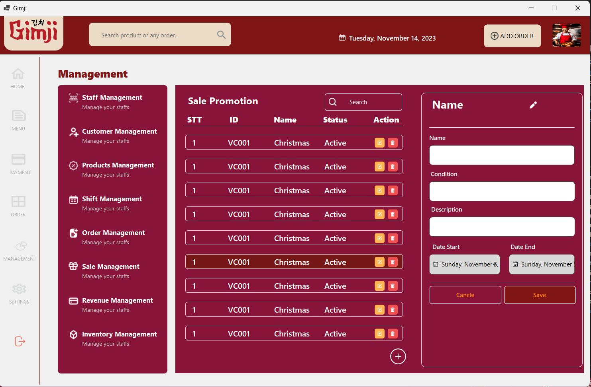
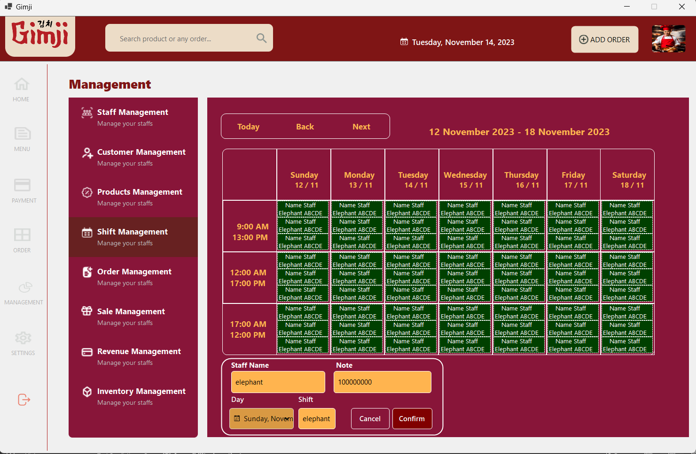
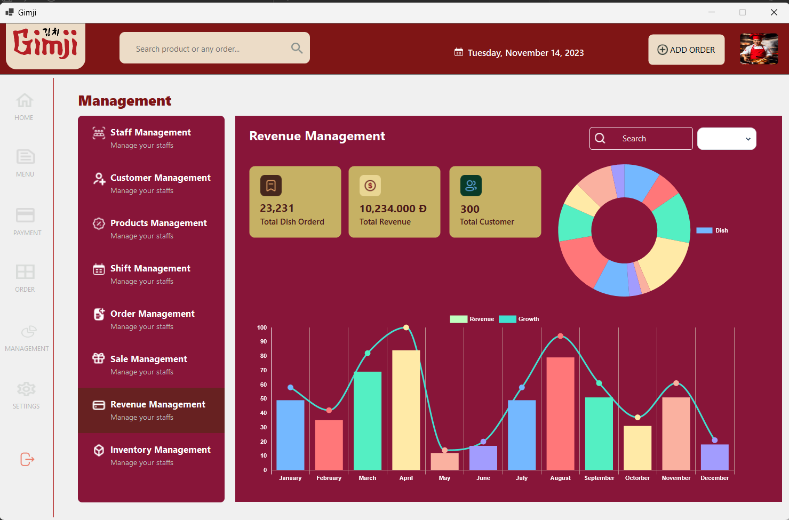

# 🍽 WinForms Restaurant GimJi Management System
📌 *[View Vietnamese version](README_vn.md)*
## 📌 Introduction

### 🏢 What is a Restaurant Management System?

A restaurant management system is a crucial process that helps restaurant owners optimize operations—from managing menus, tables, and customers to tracking revenue and employee performance. This type of system automates tasks, minimizes errors, and improves customer experience.

### 🖥️ What Can This Application Do?

This is a restaurant management application developed using **WinForms** following a **3-Layer Architecture**, including:

* **DAO (Data Access Object)**: Handles data access from MySQL.
* **BLL (Business Logic Layer)**: Processes business logic.
* **DTO (Data Transfer Object)**: Defines data structures.
* **GUI (Graphical User Interface)**: Provides user interaction through graphical interface.

## ✨ Features

### 🔹 For Employees

✔ Login, register, and forgot password (with email confirmation)
✔ View product list and invoice details
✔ Shopping cart, payment, and invoice export
✔ Customer management

### 🔹 For Admins

✔ Manage employee accounts
✔ Dashboard: revenue statistics and sales reports
✔ Manage customers and staff
✔ Manage menu items, tables, and vouchers

## 🛠️ Technologies Used

* **Programming Language**: C# (WinForms)
* **Database**: MySQL
* **Email Sending**: SMTP (MailKit)

## 📷 Application Screenshots

* **Login Screen**
  

* **Register Screen**
  

* **Forgot Password Screen (Email Confirmation)**
  

* **Table Booking Interface**
  

* **Payment Interface**
  

* **Product Display Screen**
  

* **Order Summary Screen**
  

* **Staff Management Interface**
  

* **Customer Management Interface**
  

* **Product Management Interface**
  

* **Voucher / Discount Code Management**
  

* **Order Management Interface**
  

* **Shift Management Interface**
  

* **Sales Statistics Dashboard**
  

* **Inventory Management Interface**
  

## 🚀 How to Run the Application

### 1️⃣ Install Required Tools

* Install **Visual Studio** (with WinForms support)
* Install **MySQL Server** & **MySQL Workbench**

### 2️⃣ Configure the Database

* Import the `restaurant_db.sql` file into MySQL
* Update the connection string in the `app.config` file

### 3️⃣ Run the Application

* Open the project in **Visual Studio**
* Build and run the application (`F5`)

## 👤 Author

**Thành Long**

📧 **Contact**: thanhlongndp@gmail.com
## 📜 License

This project is licensed under the **MIT License**.

---

🚀 *Made with ❤️ by Long*

---

