# 🍽 WinForms Restaurant GimJi Management System
📌 *[Xem bảng tiếng anh](README.md)*
## 📌 Giới thiệu
### 🏢 Hệ thống quản lý nhà hàng là gì?
Quản lý nhà hàng là một quy trình quan trọng giúp chủ nhà hàng tối ưu hóa hoạt động kinh doanh, từ quản lý thực đơn, bàn ăn, khách hàng đến theo dõi doanh thu và hiệu suất nhân viên. Một hệ thống quản lý nhà hàng giúp tự động hóa các tác vụ này, giảm thiểu sai sót và nâng cao trải nghiệm khách hàng.

### 🖥️ Ứng dụng này làm được gì?
Đây là ứng dụng quản lý nhà hàng được phát triển bằng **WinForms** theo mô hình **3 Layer** bao gồm:
- **DAO (Data Access Object)**: Truy xuất dữ liệu từ MySQL.
- **BLL (Business Logic Layer)**: Xử lý logic nghiệp vụ.
- **DTO (Data Transfer Object)**: Định nghĩa các đối tượng dữ liệu.
- **GUI (Graphical User Interface)**: Giao diện ứng dụng.

## ✨ Tính năng

### 🔹 Phía Nhân Viên
✔ Đăng nhập, đăng ký, quên mật khẩu (có gửi email xác nhận).
✔ Xem danh sách sản phẩm, chi tiết hóa đơn.
✔ Giỏ hàng, thanh toán, xuất hóa đơn.
✔ Quản lý khách hàng.

### 🔹 Phía Quản Trị Viên
✔ Quản lý tài khoản nhân viên.
✔ Dashboard: Thống kê doanh thu, báo cáo bán hàng.
✔ Quản lý khách hàng, nhân viên.
✔ Quản lý món ăn, bàn, voucher.

## 🛠️ Công nghệ sử dụng
- **Ngôn ngữ lập trình**: C# (WinForms)
- **Cơ sở dữ liệu**: MySQL
- **Gửi Email**: SMTP (MailKit)

## 📷 Giao diện ứng dụng
📌
* **Login Screen**
  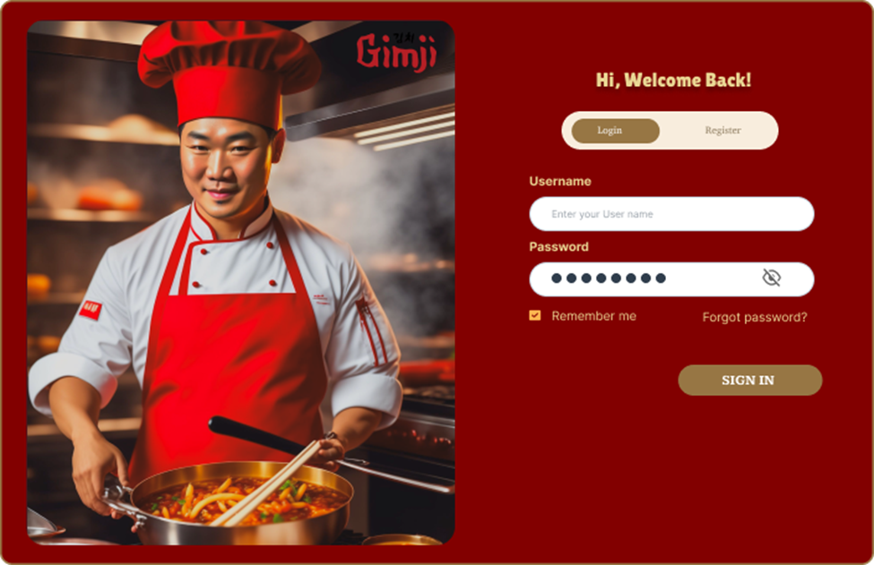

* **Register Screen**
  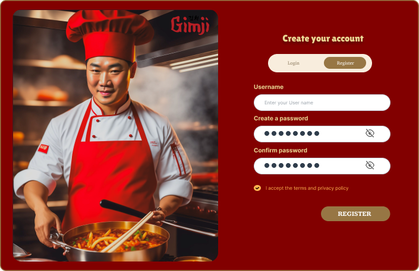

* **Forgot Password Screen (Email Confirmation)**
  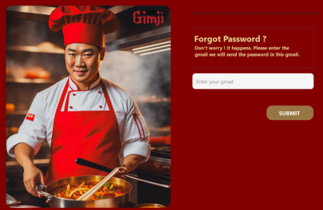

* **Table Booking Interface**
  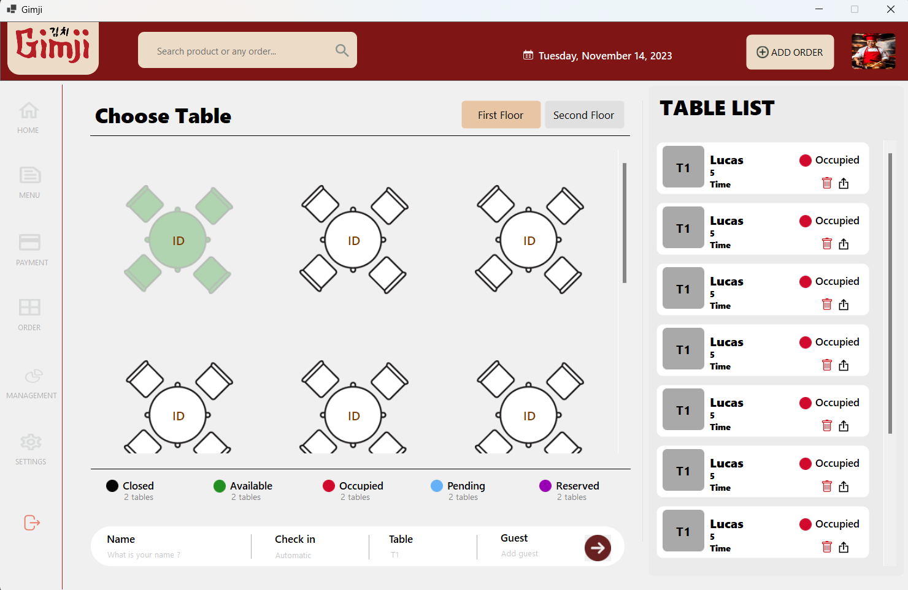

* **Payment Interface**
  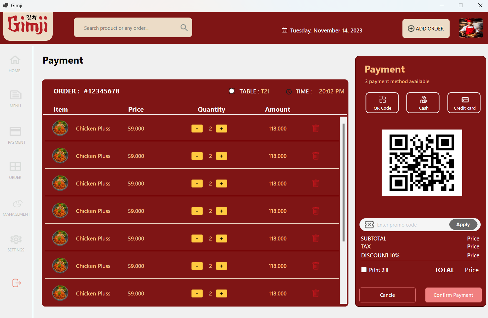

* **Product Display Screen**
  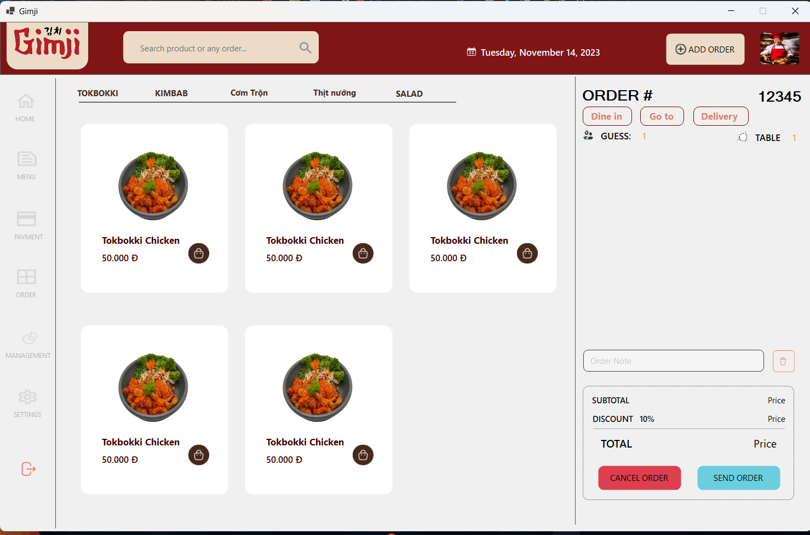

* **Order Summary Screen**
  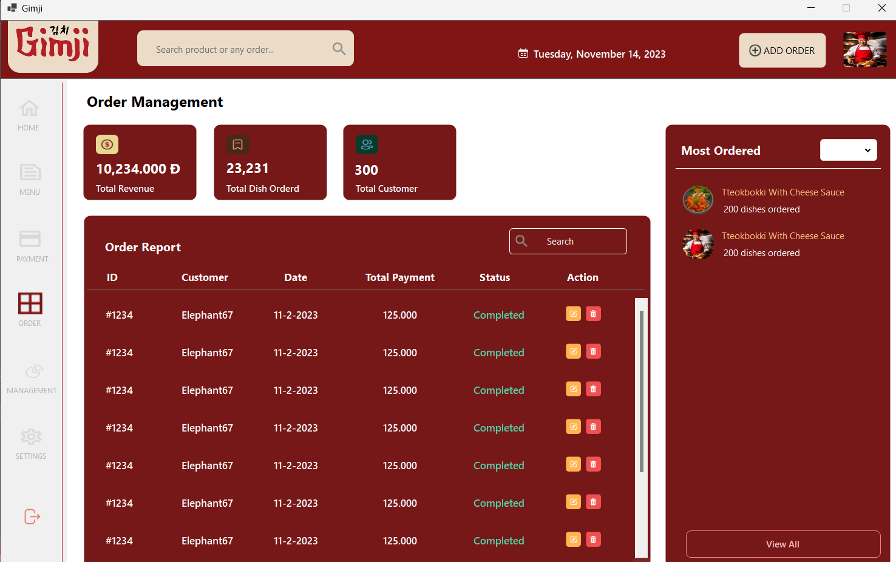

* **Staff Management Interface**
  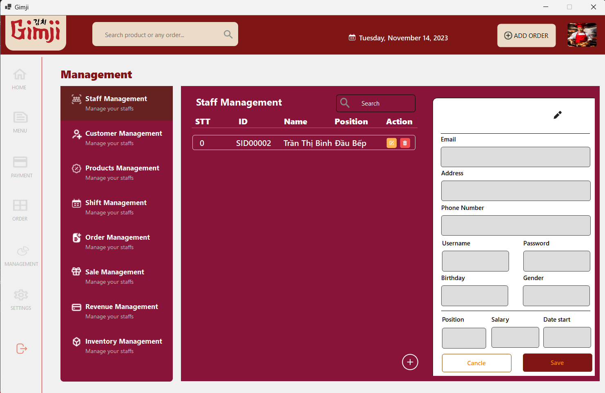

* **Customer Management Interface**
  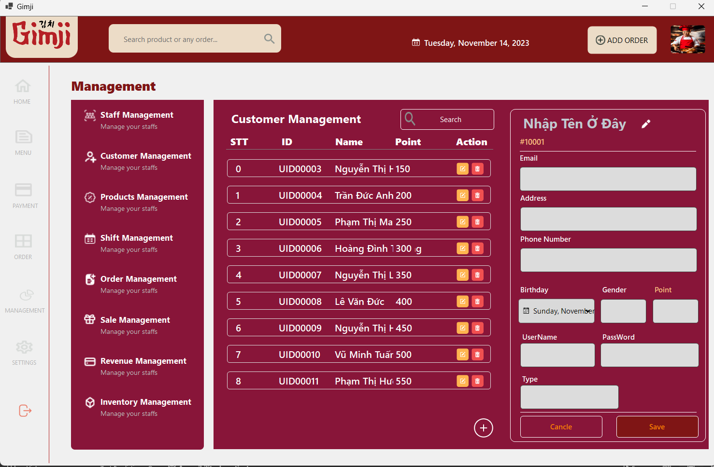

* **Product Management Interface**
  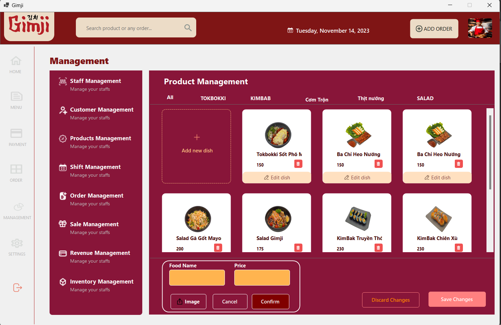

* **Voucher / Discount Code Management**
  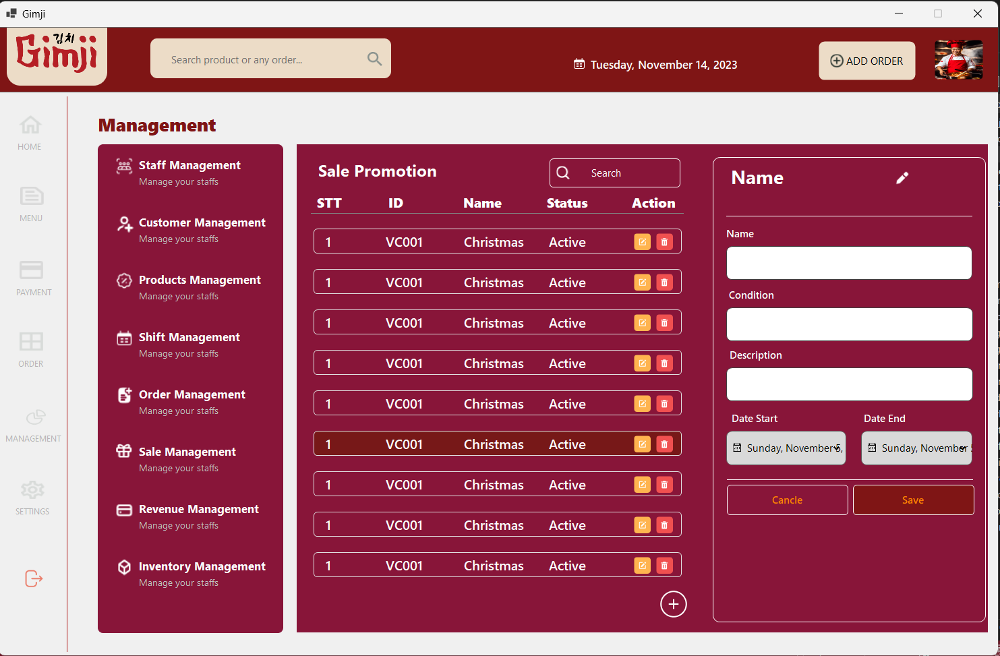

* **Order Management Interface**
  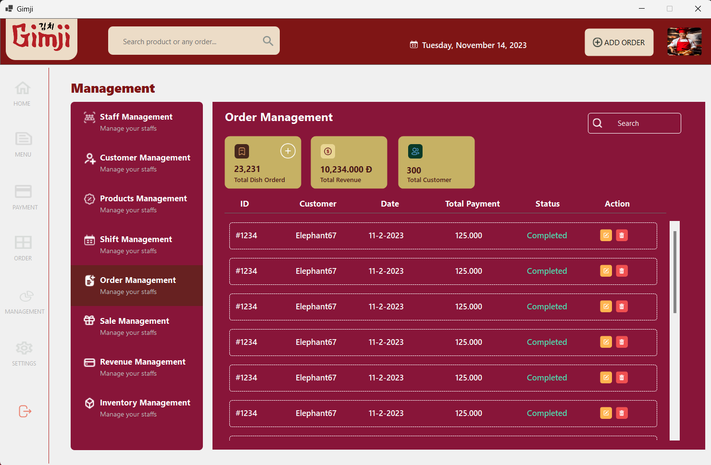

* **Shift Management Interface**
  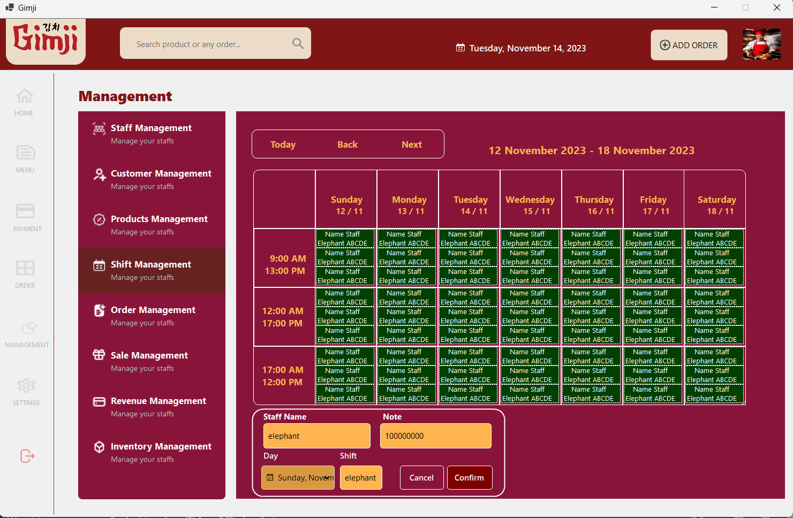

* **Sales Statistics Dashboard**
  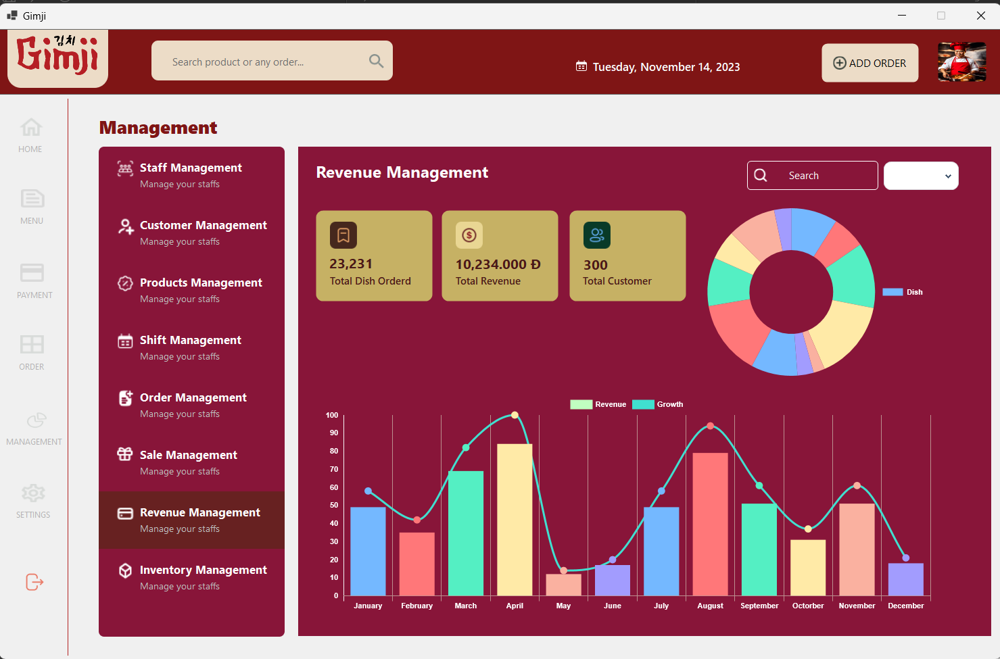

* **Inventory Management Interface**
  

## 🚀 Cách chạy ứng dụng
### 1️⃣ Cài đặt các công cụ cần thiết
- Cài đặt **Visual Studio** (bản hỗ trợ WinForms)
- Cài đặt **MySQL Server** & **MySQL Workbench**

### 2️⃣ Cấu hình database
- Import file `restaurant_db.sql` vào MySQL
- Cập nhật chuỗi kết nối trong file `app.config`

### 3️⃣ Chạy ứng dụng
- Mở project bằng **Visual Studio**
- Build và chạy ứng dụng (`F5`)

## 👤 Tác Giả
**Thành Long**

📧 **Liên hệ**: thanhlongndp@gmail.com

## 📜 Giấy Phép
Dự án được phát hành theo giấy phép **MIT**.

---
🚀 *Made with ❤️ by Long*

